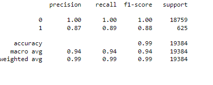
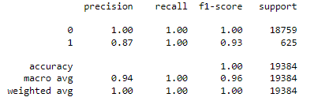

# credit-risk-classification

## Background
In this Challenge, I’ll use various techniques to train and evaluate a model based on loan risk. I’ll use a dataset of historical lending activity from a peer-to-peer lending services company to build a model that can identify the creditworthiness of borrowers.

### Instructions
The instructions for this Challenge are divided into the following subsections:

- Split the Data into Training and Testing Sets
- Create a Logistic Regression Model with the Original Data
- Write a Credit Risk Analysis Report

#### Split the Data into Training and Testing Sets
Open the starter code notebook and use it to complete the following steps:

1: Read the **lending_data.csv** data from the Resources folder into a Pandas DataFrame.

2: Create the labels set (y) from the **“loan_status”** column, and then create the features (X) DataFrame from the remaining columns.

**NOTE:** A value of 0 in the “loan_status” column means that the loan is healthy. A value of 1 means that the loan has a high risk of defaulting.

3: Split the data into training and testing datasets by using **train_test_split**.

#### Create a Logistic Regression Model with the Original Data
I'll use logistic regression to complete the following steps:

1: Fit a logistic regression model by using the training data (X_train and y_train).

2: Save the predictions for the testing data labels by using the testing feature data (X_test) and the fitted model.

3: Evaluate the model’s performance by doing the following:

  - Generate a confusion matrix.
  - Print the classification report.

4: Then, I'll answer the following question: How well does the logistic regression model predict both the 0 (healthy loan) and 1 (high-risk loan) labels?

#### Write a Credit Risk Analysis Report
I'll write a brief report that includes a summary and analysis of the performance of the machine learning models that I used in this challenge.
I'll structure my report to ensure that it contains the following:

1: **An overview of the analysis:** Explain the purpose of this analysis.

2: **The results:** I'll use a bulleted list, and describe the accuracy score, the precision score, and the recall score of the machine learning model.

3: **A summary:** Next, I'll summarize the results from the machine learning models and provide my justification for recommending a particular model for the company's use. If I don't recommend any model, I'll also provide my reasons for that decision.

**Overview of the Analysis:**
Credit risk management is pivotal in financial industries, especially in the banking and lending sectors. This analysis was geared toward predicting the creditworthiness of loan borrowers using machine learning models.

- Purpose of Analysis:
The principal aim was to leverage machine learning to anticipate the probability of a loan being high-risk (1) or healthy (0). This predictive capability aids financial institutions in making informed lending decisions, thereby minimizing potential losses.

- Financial Information: The dataset comprised various financial metrics and details about borrowers. Our primary objective was to predict the risk associated with each loan – whether it is likely to be healthy or high-risk.

- Variables: The target variable was binary: healthy loan (0) or high-risk loan (1). Initial data inspection indicated an imbalance in the distribution, with a notably higher number of healthy loans compared to high-risk ones.

- Machine Learning Process: The steps entailed data preprocessing, splitting the data into training and test sets, and then applying machine learning models. Due to the class imbalance, resampling techniques were also employed.

- Methods Used: LogisticRegression was the primary machine learning algorithm utilized. Given the class imbalance, the RandomOverSampler method from the imbalanced-learn library was also employed to balance the data.

**Results:**
**Machine Learning Model 1 (Initial Logistic Regression Model):**
- Balanced Accuracy Score: Approximately 99%
- Precision: Healthy Loans (0): 1.00; High-risk Loans (1): 0.87
- Recall: Healthy Loans (0): 1.00; High-risk Loans (1): 0.89
- F1-Score: Healthy Loans (0): 1.00; High-risk Loans (1): 0.88

  
**Machine Learning Model 2 (Logistic Regression with Over-sampled Data):**
- Balanced Accuracy Score: Approximately 100%
- Precision: Healthy Loans (0): 1.00; High-risk Loans (1): 0.87
- Recall: Healthy Loans (0): 1.00; High-risk Loans (1): 1.00
- F1-Score: Healthy Loans (0): 1.00; High-risk Loans (1): 0.93

  
**Summary**
Upon evaluation of the models:

- The Logistic Regression model, when trained with over-sampled data, demonstrated slightly superior performance, particularly in detecting high-risk loans. The recall for high-risk loans, a vital metric in this context, reached 100%.

- The priority in predicting high-risk loans (1s) is higher because wrongly approving a high-risk loan can lead to more significant financial consequences than declining a healthy loan. The model with the oversampled data exhibited a remarkable ability to detect high-risk loans, making it the preferred choice.

**Recommendation:**
Adopt the Logistic Regression model trained on over-sampled data for credit risk prediction. Its performance, especially in identifying high-risk loans, makes it exceptionally suitable for this use-case.

***References***

Data for this dataset was generated by edX Boot Camps LLC.
